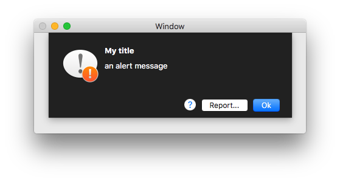
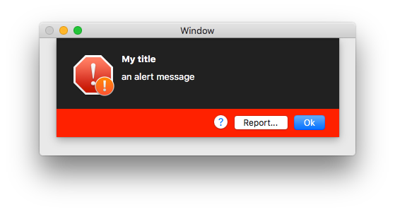

# AlertController

[](http://mit-license.org)
[](https://developer.apple.com/resources/)
[](https://developer.apple.com/swift)
[](https://github.com/phimage/AlertController/issues)
[](http://cocoadocs.org/docsets/NSAlertController/)

A `NSViewController` to display an alert message to the user.
This class replaces the `NSAlert` class and is inspired from `UIAlertController`.

After configuring the alert controller with the actions and style you want, present it using `presentViewControllerAsSheet`.

```swift
let controller = AlertController(title: "Alert title", message: "An alert message", preferredStyle: .warning)
parentVC.presentViewControllerAsSheet(controller)

```

## Usage

### Add a simple dismiss action
```swift
controller.add(action: AlertAction.dismiss(for: controller, title: "Ok"))
```
### Add custom action
```swift
controller.add(action: AlertAction(title: "Report...") { action in
    NSWorkspace.shared().open(URL(string: "https://github.com/phimage/AlertController/issues")!)
})
```
### Choose a style
```swift
controller.addAction(title: "", style: .helpButton) { action in
    // show error help
}
```

### Customize buttons bar
```swift
controller.buttonsBar.color = NSColor.red
controller.buttonsBar.buttonSpace = 8
```


## Todo
- More customization
  - align buttons left or right
  - automatic helpButton on left
- Maybe input text fields

## Installation

### Using CocoaPods ##
[CocoaPods](https://cocoapods.org/) is a centralized dependency manager for
Objective-C and Swift. Go [here](https://guides.cocoapods.org/using/index.html)
to learn more.

1. Add the project to your [Podfile](https://guides.cocoapods.org/using/the-podfile.html).

    ```ruby
    use_frameworks!

    pod 'NSAlertController'
    ```

2. Run `pod install` and open the `.xcworkspace` file to launch Xcode.

### Using Carthage ##
```ruby
github 'phimage/AlertController'
```
